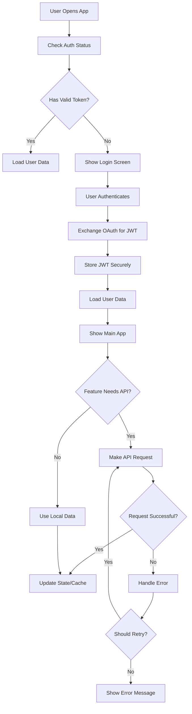

# Mobile App ↔ API Integration

This document covers **how** the mobile app integrates with the backend API. For **what** endpoints are needed, see [mobile-app-design.md](./mobile-app-design.md#api-integration).

---

## Constraints

- App requires network connectivity; **offline mode is out of scope** for MVP.
- Both local development and production must connect to a running API instance.

---

## API URL Discovery

> **Question:** Will we use Expo environment variables (e.g., `EXPO_PUBLIC_API_URL`) for API URL configuration? Or a different mechanism?

**Options:**
- `EXPO_PUBLIC_API_URL` in `.env` files (simplest, Expo-native)
- Build-time config via `app.config.js` extras
- Runtime config fetched from a bootstrap endpoint

---

## Authentication Flow

Mobile app uses OAuth (Apple/Google) → exchanges for JWT from our API.

> **Question:** What secure storage mechanism for tokens? `expo-secure-store` is the standard choice.

> **Question:** Token lifetime and refresh strategy? Options:
> - Short-lived access token (15 min) + refresh token
> - Longer-lived access token (7 days) with silent refresh on 401

**Flow:**
1. User authenticates via Apple/Google (expo-auth-session)
2. Mobile app sends OAuth token to API (`POST /api/auth/{provider}`)
3. API validates OAuth token, creates/retrieves user, returns JWT
4. Mobile app stores JWT in secure storage
5. All subsequent requests include `Authorization: Bearer <token>`

---

## Request/Response Patterns

### Error Handling
- API returns consistent error shape: `{ error: string, code?: string }`
- Mobile app displays user-friendly messages, logs technical details

### Retry Logic
- Retry on network failures (exponential backoff, max 3 attempts)
- Do not retry on 4xx errors (client errors)
- On 401, attempt token refresh once before failing

---

## Features Requiring API

| Feature | Endpoint Area | Notes |
|---------|---------------|-------|
| User authentication | `/api/auth/*` | OAuth token exchange |
| User profile management | `/api/users/*` | CRUD profile, avatar, settings |
| Quest discovery | `/api/quests/*` | List, search, filter |
| Quest purchase | `/api/purchases/*` | Stripe integration |
| Quest progress tracking | `/api/progress/*` | Save/resume waypoint state |
| Quest completion | `/api/progress/*` | Mark complete, unlock review |
| Reviews & ratings | `/api/reviews/*` | Submit after completion |
| Waypoint scouting | `/api/waypoints/*` | Write tab → Creator Station sync |

> **Clarification needed:** "Sync for creator station" — Is this specifically the waypoint scouting feature (saving pins from mobile for use in Creator Station), or is there additional sync behavior?

---

## Endpoint Schemas

> **Question:** Should this document include detailed request/response JSON schemas, or defer those to the API codebase (e.g., Zod schemas, OpenAPI spec)?

**Recommendation:** Keep schemas in API codebase as source of truth; this doc describes integration patterns only.

---

## Open Questions Summary

1. API URL discovery mechanism?
2. Token storage: `expo-secure-store`?
3. Token lifetime / refresh strategy?
4. "Sync for creator station" scope?
5. Where to maintain endpoint schemas?

## Control Flow Diagram

